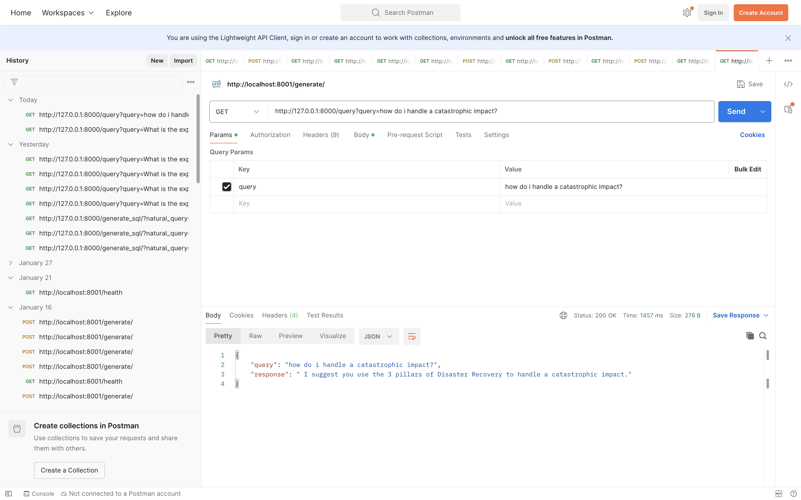

# **Retrieval-Augmented Generation (RAG) using Llama 3.2 for Impact Assessment Suggestions**
***
Retrieval-Augmented Generation (RAG) is an AI framework that enhances large language models (LLMs) like Llama 3.2 by integrating external knowledge retrieval mechanisms. This approach enables the model to fetch relevant information from external documents (e.g., research papers, reports, databases) and use that knowledge to generate more informed and contextually accurate responses.In this implementation, Llama 3.2 is used to assist in impact assessment—a process used in our organisation evaluate the potential effects of an action or decision. The RAG framework enables the system to retrieve relevant documents, case studies, regulations, and past assessments to provide accurate, up-to-date, and evidence-based suggestions.
***
## **Methodology**
This project implements a **Retrieval-Augmented Generation (RAG) pipeline** using **FastAPI**, **Llama 3.2**, **ChromaDB**, and **Sentence Transformers** to process and analyze PDF documents. The following methodology outlines the key steps in the implementation:

### 1. **PDF Text Extraction**
- The system extracts textual content from a given PDF file using the `pypdf` library.
- It iterates through all pages, extracting text and aggregating it into a single document.

### 2. **Text Chunking**
- The extracted text is divided into smaller, manageable chunks using `textwrap.wrap()`.
- This ensures that the retrieval mechanism works efficiently and provides relevant responses based on meaningful sections of the document.

### 3. **Embedding Generation and Storage in ChromaDB**
- Each text chunk is converted into a vector embedding using the **`SentenceTransformer` model (all-MiniLM-L6-v2)**.
- The embeddings, along with the corresponding text chunks, are stored in **ChromaDB**, a vector database for efficient similarity search.

### 4. **Retrieval of Relevant Context**
- When a user submits a query, it is encoded into an embedding vector using the same `SentenceTransformer` model.
- The query vector is compared against stored embeddings in **ChromaDB** to retrieve the **top-k most relevant text chunks**.

### 5. **Context-Aware Query Resolution Using Llama 3.2**
- The retrieved text chunks are formatted as context for the **Llama 3.2 model**.
- A structured prompt is created, incorporating the retrieved context and user query.
- The **Llama model** generates an insightful, context-aware response.

### 6. **FastAPI Endpoint for Query Processing**
- The project exposes a FastAPI endpoint (`/query`) where users can submit queries.
- The system performs the retrieval and generation steps to return a well-informed response.

### 7. **Deployment and Execution**
- The initial step requires storing the processed PDF data into ChromaDB.
- The API then handles real-time user queries and dynamically generates responses using retrieved information.

This methodology ensures efficient document analysis and an enhanced response generation process by leveraging **retrieval-based augmentation** with an **LLM**.
***
## **OUTPUT ON POSTMAN**

